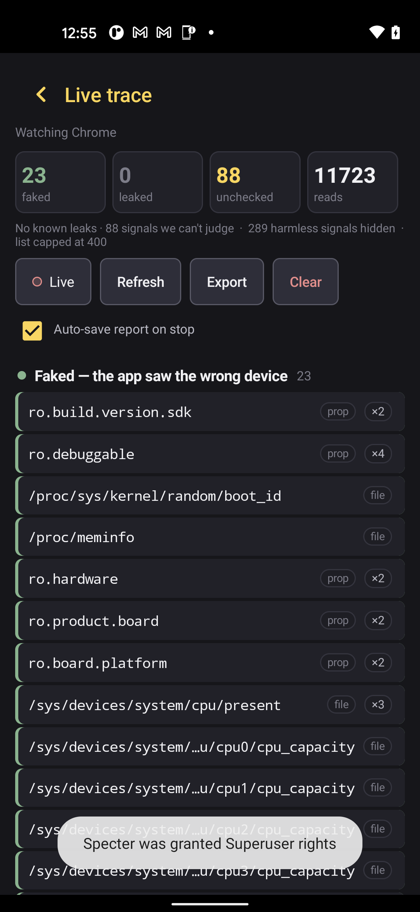

# 👻 Specter

### Per-app device-identity rotation for Android

Give every account a **fresh, coherent, never-reused** device fingerprint — so fraud systems can't link your accounts by a repeated identifier.

[**Download the latest APK →**](../../releases/latest) · [How it works](#how-it-works) · [Compared to the alternatives](#how-specter-compares) · [Setup](#setup)

---

Left: one tap applies a coherent identity to your target apps. Right: the live trace watching a target app read the device — <b>23 signals faked, 0 leaked.</b>

---

## Why

Identifier spoofers that reuse a value get you linked and banned. The tools that came before left most of the hardware **real** and rotated only a handful of IDs — so a fraud stack could still fingerprint the untouched signals and tie the accounts together.

Specter's one rule: **no identifier is ever reused, and the whole device reads coherent.** The Build fields match the model, the IMSI matches the SIM carrier, US devices pair with US carriers. An incoherent device is itself a flag — so Specter never ships one.

## How it works

- **Two injection layers, both proven on-device.** A Java (LSPosed) layer and a native (Zygisk) layer spoof in lockstep — every `ro.*` property reads the same faked value on **both** the Java and native paths (model, hardware, serial, board, fingerprint, bootloader, baseband, …). Tools that only hook Java leak the moment an app reads a property natively.
- **Coherent, US-market profiles from 499 real devices.** Pick one real device row; every field — Build, SoC/board, CPU topology + cache tree, GPU vendor, RAM (`/proc/meminfo`), storage (StatFs), sensors — is made to match it.
- **Full identifier set, per app:** serial, both IMEI slots, SIM (IMSI/ICCID/line1/MCC-MNC), android_id/SSAID, GSF ID, Advertising ID, MediaDrm/Widevine ID (+ security level → L3), Bluetooth/Wi-Fi MAC/SSID.
- **Never-reused, enforced.** A race-safe ledger guarantees uniqueness (5000+ generations, zero collisions) — not "should be unique," *guaranteed* unique.
- **Timezone follows the proxy, not the phone.** When you route through a VPN/proxy, the device timezone auto-aligns to the exit IP (and never to your home IP).
- **Read it back — don't trust the tool.** A dual-read probe reads what the target app *actually* stored and shows a per-field ✅/❌, so "faked" means faked, measured.
- **One-tap setup.** Installs the native layer, scopes your apps, blocks OS updates, sets software DRM, and reboots — from inside the app.

## How Specter compares

| | **Specter** | GeerGit | byedentity | Mirage* |
|---|:---:|:---:|:---:|:---:|
| Two-layer (Java **+** native) spoof | ✅ proven | Java-mostly | native shell | Xposed only |
| Hardware coherence (Build/SoC/RAM/board) | ✅ enforced | ⚠️ leaves HW real | ❌ left real | not verified |
| Both IMEI slots + full SIM/telephony | ✅ | partial | ❌ | not verified |
| MediaDrm / Widevine → L3 | ✅ (no root for the spoof) | ❌ L1 leaks | ✅ (root bind-mount) | not verified |
| Never-reused guarantee | ✅ enforced ledger | ⚠️ manual / increment | n/a | not verified |
| USA-coherent values | ✅ full | partial | ❌ | not verified |
| Works offline / no server leash | ✅ stateless | ✅ | ❌ phone-home + kill-switch | ❌ login + Firebase |
| On-device read-back verification | ✅ probe | ❌ | ❌ | ❌ |

*Mirage: capabilities not independently verified — it ships a login + Firebase backend (a server leash), which Specter deliberately avoids. GeerGit/byedentity cells are sourced from decompile analysis. Specter deliberately rejected byedentity's HMAC attestation + remote kill-switch: a phone-home is itself a signal.

## Honest limits (read this)

Specter owns **one** of the three layers that link accounts, and it owns it well:

- ✅ **Device** — clean, coherent, never-reused. Proven, read-back-verified.
- ❌ **Identity** — a name/selfie/SSN is yours to manage; no device tool touches it.
- ❌ **Location & behaviour** — pair Specter with a proxy + GPS; a device spoof alone isn't a full picture.

Also true, stated plainly:
- **Root required** (Magisk + Zygisk + LSPosed). This is a power tool, not a one-tap app-store install.
- Specter makes every **identifier** fresh, coherent, and verified-spoofed. A full commercial-fingerprinter *link-break* is **not** claimed on every hardware — some anchors live below any in-process hook. Specter closes the identifier and coherence gaps that get accounts linked; it is not magic.
- The network layer (proxy quality, datacenter-IP reputation) is your proxy's job, not Specter's.

## Setup

1. A rooted Android device: **Magisk + Zygisk** on, **LSPosed** installed.
2. Install the [latest APK](../../releases/latest).
3. Open Specter → **Set up everything** (installs the native layer, scopes your apps, OTA-block, DRM, reboots).
4. Enter your activation key on the **Activation** screen.
5. Randomize → Apply. Open your target app on a fresh, coherent device.

## Access

Specter is licensed. Activation keys are device-bound and come in **1-day / 1-week / 2-week / 1-month / permanent** tiers. Contact the operator for a key.

---

USA device profiles · Android 7–15 (minSdk 24) · brands: Google · Motorola · Samsung · LGE

