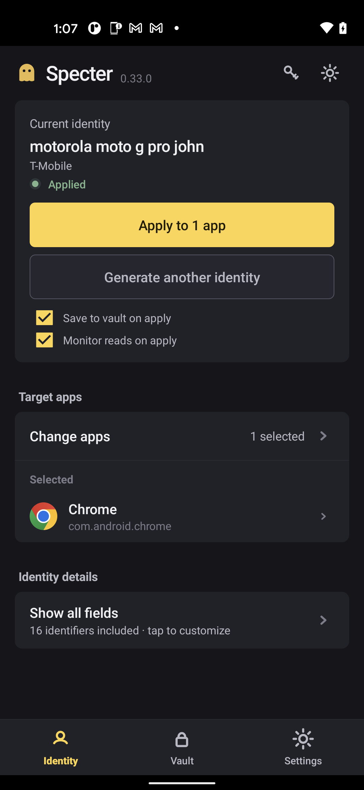
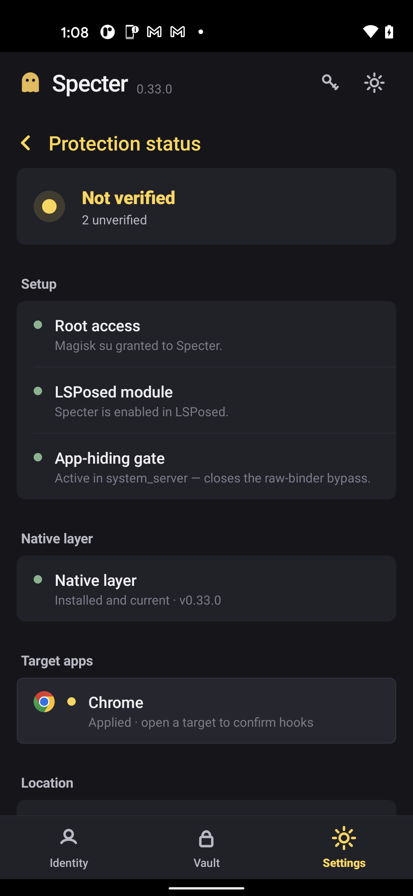

# 👻 Specter

**A fresh phone for every account.**
Per-app device identities that never repeat — so your accounts never get linked.

[**⬇️ Download APK**](../../releases/latest) · [Setup](#setup) · [Get a key](#access)

---

## What you get

- 🎭 **A different device per app** — give every account its own phone identity, applied in one tap.
- 🔒 **Never reused** — every identity is unique and internally consistent, so nothing links your accounts.
- 🧪 **Built-in IP reputation check** — test your proxy/exit IP for fraud, VPN, and blacklist flags *before* you sign up.
- 💾 **Fingerprint vault** — save any identity and reload it anytime.
- 📲 **Save & restore logins** — keep your logged-in sessions and switch between them without signing in again.
- 🌍 **Timezone follows your proxy** — the device clock matches your exit location automatically.
- ✅ **Proof it worked** — a built-in check reads back what each app actually sees.
- ⚡ **One-tap setup** — installs everything and gets you running.
- 🕵️ **Yours alone** — works offline, no account, no phone-home.
- 🇺🇸 **Realistic US profiles** — real device models paired with US carriers.

## Setup

1. A rooted Android phone (Magisk + Zygisk + LSPosed).
2. Install the [latest APK](../../releases/latest).
3. Open Specter → **Set up everything** → reboot.
4. Enter your key on the **Activation** screen.
5. Randomize → Apply. Done.

## Access

Keys are device-bound and come in **1 day · 1 week · 2 weeks · 1 month · permanent**. Contact the operator for a key.

Android 7–15 · USA device profiles

