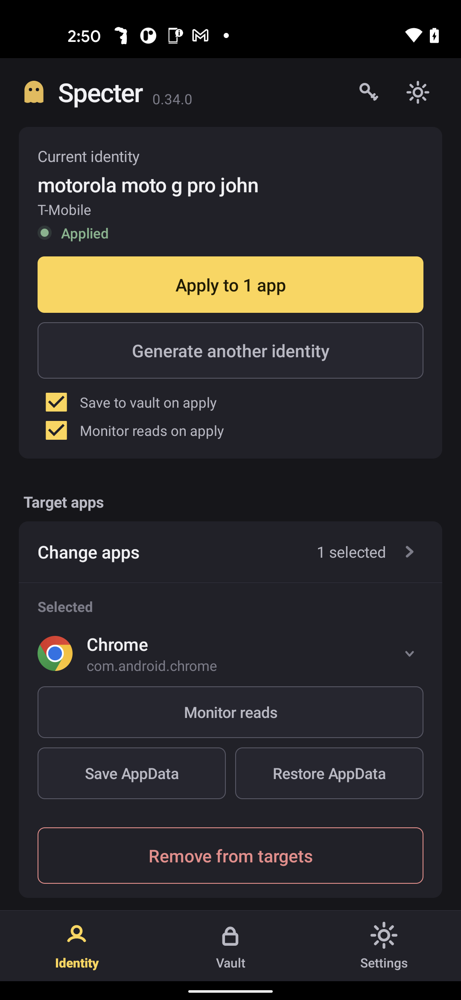
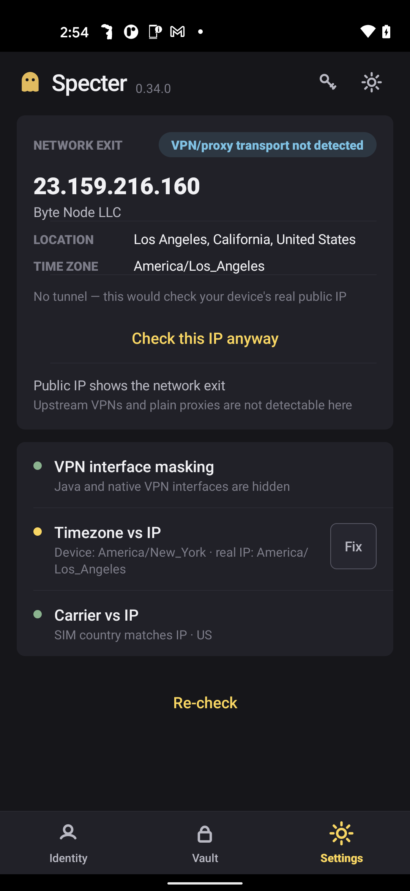

# 👻 Specter

### A unique device profile for every app session

Per-application device configuration profiles that never repeat, so device intelligence platforms cannot correlate sessions by a repeated identifier.

[**🌐 Live site**](https://aaronvstory.github.io/specter-app/) · [**⬇️ Download APK**](../../releases/latest) · [How it works](#how-it-works) · [Setup](#setup) · [Get a key](#access) · [Full breakdown](#full-breakdown--how-specter-compares)

 &nbsp; &nbsp;

Apply a profile · verify every layer is live · save/restore sessions per app · check your exit IP

---

## What you get

- 🎭 **A different device per app session.** Give every application session its own device configuration profile, applied in one tap.
- 🔒 **Never reused.** Every profile is unique and internally consistent, so nothing correlates your sessions.
- 🧪 **Built-in IP reputation check.** Test your proxy/exit IP for risk flags *before* you connect.
- 💾 **Profile vault.** Save any configuration and reload it anytime.
- 📲 **Save & restore sessions.** Keep your initialized sessions and switch between them without re-initializing.
- 🌍 **Timezone follows your proxy.** The device clock matches your exit location automatically.
- ✅ **Proof it worked.** A built-in check reads back what each app actually sees.
- ⚡ **One-tap setup.** Installs everything and gets you running.
- 🕵️ **Yours alone.** Works offline, no account, no phone-home.
- 🦅 **Realistic US profiles.** Real device models are paired with US carriers.

## How it works

**1.** Open a target app on a fresh, unique device configuration profile. → **2.** Save the session state. → **3.** Apply a new profile for the next session. The previous session state is safely vaulted and restorable.

Every application session sees a different device parameter set. Nothing carries over to correlate them.

## Specter Lite: free, no root

Not rooted? **[Specter Lite](../../releases/latest)** is a free companion app that reads your device's current parameter set (every identifier an app can read without root) and shows it in one place, so you know exactly what your phone looks like to the apps you use. No configuration, no root, no key required. The full Specter (above) is what rotates that parameter set per session.

## Setup

1. A rooted Android phone (Magisk + Zygisk + LSPosed).
2. Install the [latest APK](../../releases/latest).
3. Open Specter → **Set up everything** → reboot.
4. Enter your key on the **Activation** screen.
5. Randomize → Apply. Done.

## Access

Keys are device-bound and come in **1 day · 1 week · 2 weeks · 1 month · permanent**. Contact the operator for a key.

---

<b>Full breakdown &amp; how Specter compares</b>

### Why

Device configuration tools that reuse a parameter value get sessions correlated and blocked. The tools that came before left most of the hardware **real** and rotated only a handful of IDs, so a device analytics platform could still read the untouched signals and tie the sessions together.

Specter's one rule: **no identifier is ever reused, and the whole device reads coherent.** The Build fields match the model, the IMSI matches the SIM carrier, US devices pair with US carriers. An incoherent device is itself a detectable inconsistency, so Specter never ships one.

### What makes it different

- **Two injection layers, both proven on-device.** Specter configures on *both* the app layer and the layer beneath it, in lockstep, so a parameter read the "deep" way is covered too. Tools that only cover the app layer leak the moment something looks lower.
- **Coherent, US-market profiles from real device models.** Every field is made to match one real device, top to bottom, not a random mix that reads as inconsistent.
- **Full parameter set, per session.** It is the complete set of device identifiers an app can read, all fresh and consistent.
- **Never-reused, enforced.** A race-safe ledger guarantees uniqueness (5000+ generations, zero collisions), not "should be unique," *guaranteed* unique.
- **Timezone follows the proxy, not the phone.** It auto-aligns to your exit IP, never your home IP.
- **Read it back, don't trust the tool.** A built-in probe reads what the target app *actually* stored and shows a per-field ✅/❌.
- **One-tap setup.** Installs everything and reboots, from inside the app.

### How Specter compares

| | **Specter** | GeerGit | byedentity | Mirage\* |
|---|:---:|:---:|:---:|:---:|
| Two-layer (app **+** deep) configuration | ✅ proven | app-mostly | deep only | app only |
| Hardware coherence (model/chip/RAM/board) | ✅ enforced | ⚠️ leaves HW real | ❌ left real | not verified |
| Both SIM slots + full telephony | ✅ | partial | ❌ | not verified |
| Widevine → L3 | ✅ (no root for the config) | ❌ | ✅ (needs root) | not verified |
| Never-reused guarantee | ✅ enforced ledger | ⚠️ manual / increment | n/a | not verified |
| USA-coherent values | ✅ full | partial | ❌ | not verified |
| Works offline / no server leash | ✅ stateless | ✅ | ❌ phone-home + kill-switch | ❌ login + cloud |
| On-device read-back verification | ✅ probe | ❌ | ❌ | ❌ |

\*Mirage: capabilities not independently verified. It ships a login + cloud backend (a server leash), which Specter deliberately avoids. GeerGit/byedentity cells sourced from analysis. Specter deliberately rejects a remote kill-switch / phone-home: a phone-home is itself a detectable signal.

### Honest limits

- **Root required** (Magisk + Zygisk + LSPosed). This is a power tool, not a one-tap app-store install.
- Specter makes every **parameter** fresh, coherent, and verified-applied, and closes the gaps that create cross-session correlation, but it's one layer of the picture.
- The **network** layer (proxy quality, exit IP reputation) is your proxy's job, which is exactly why the IP reputation check is built in.

USA device profiles · Android 7–15 (minSdk 24) · brands: Google · Motorola · Samsung · LGE

